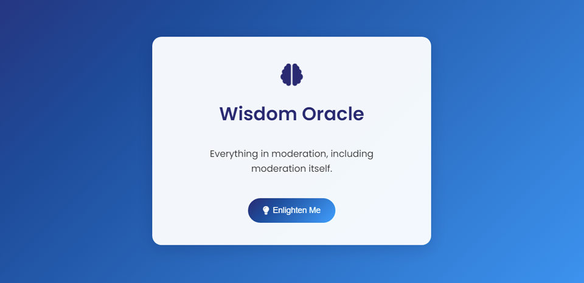

# Wisdom Oracle

A modern, interactive web application that generates random pieces of wisdom using the Advice Slip API. Built with vanilla JavaScript and features smooth CSS animations.

## Features

- 🧠 Random wisdom generation
- ✨ Sleek animations and transitions
- 📱 Fully responsive design
- 🎨 Modern gradient UI
- ⌨️ Keyboard accessible

## Live Demo

[Try it here](https://pro-tips.jackscottow.com)

## Technologies Used

- HTML5
- CSS3 (with custom animations)
- JavaScript (ES6+)
- Advice Slip API
- Font Awesome Icons

## Screenshot

## Local Development

1. Clone the repository
2. Open `index.html` in your browser
3. No build process required!

## API Reference

This project uses the [Advice Slip API](https://api.adviceslip.com/) to generate random pieces of wisdom.
